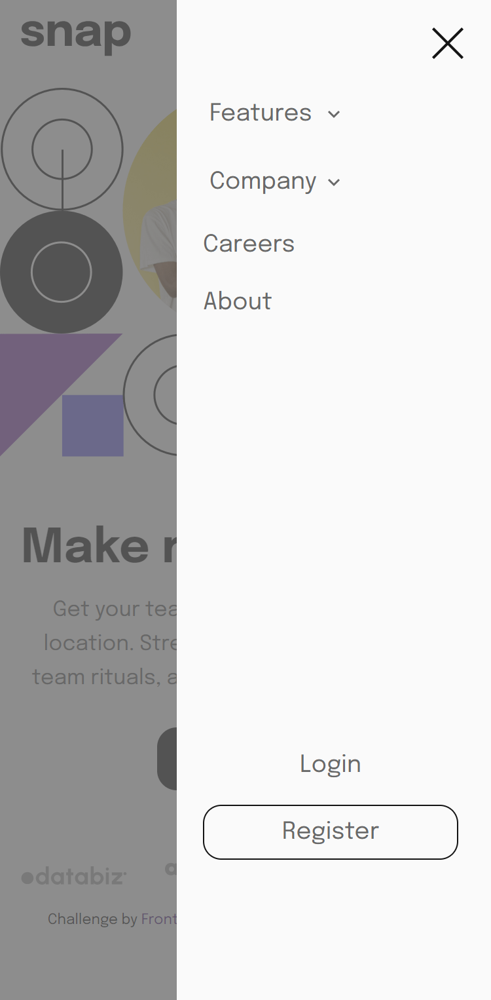
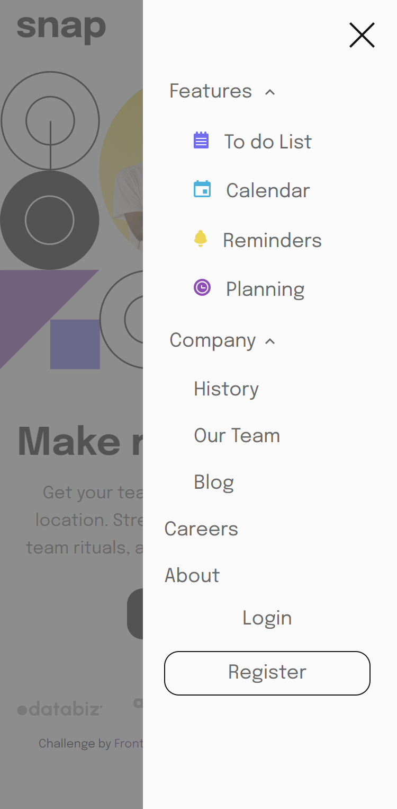
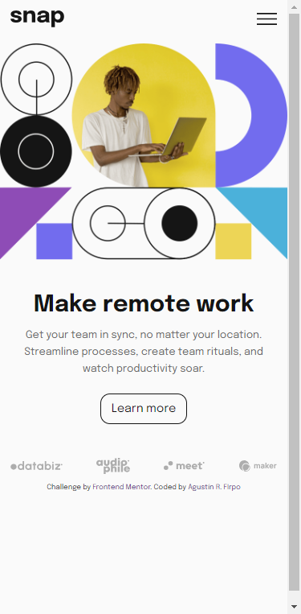

Hi everybody! 👋

# Frontend Mentor - Intro section with dropdown navigation solution

This is a solution to the [Intro section with dropdown navigation challenge on Frontend Mentor](https://www.frontendmentor.io/challenges/intro-section-with-dropdown-navigation-ryaPetHE5).

## Table of contents 🧾

- [Overview](#overview)
  - [The challenge](#the-challenge)
  - [Links](#links)
- [My process](#my-process)
  - [Built with](#built-with)
  - [What I learned](#what-i-learned)
  - [Continued development](#continued-development)
- [Author](#author)

## Overview

### The challenge 🎯

Users should be able to:

- View the relevant dropdown menus on desktop and mobile when interacting with the navigation links

navbar w/ sub-menus close:



navbar w/ sub-menus open:



- View the optimal layout for the content depending on their device's screen size

mobile design:


desktop design:


- See hover states for all interactive elements on the page

button Hover:



### Links 🔗

- Solution: [Github Repository](https://github.com/Arfirpo/intro-section-with-dropdown-navigation-main)
- Solution: [Github PAge](https://arfirpo.github.io/intro-section-with-dropdown-navigation-main/)

## My process ⚙️

### Built with 🛠️

- Semantic HTML5 markup
- Flexbox
- Mobile-first workflow
- [Sass](https://sass-lang.com/) - Css preprocessor
- Javascript

### What I learned 📚

In this challenge i had the oportunity to improve my handdle of javascript.
Particulary i learned how to design (in HTML) a completly functional menu with a sub-menu included, - how to toggle the display of my css (sass in this case) for show & hide my page´s navbar: 

```js
//opening the navbar
hamburguerMenu.addEventListener('click', ()=>{
    hamburguerMenu.style.display = 'none';
    navBar.style.display = 'block';
});

// closing the navbar
closeBtn.addEventListener('click', ()=>{
    screenSize = window.innerWidth;
    if(screenSize >= 768){
        navBar.style.display = 'block';
        hamburguerMenu.style.display = 'none';
    } else {
        hamburguerMenu.style.display = 'block';  
        navBar.style.display = 'none';
    }
});
```

Furthermore i had the chance to use, for the very first time, ternary operators to reduce the length of the functions codes.

```js
//using the ternary operator to make the navbar appear/hide when clicked in a certain place
featureSubMenu.style.display = (featureSubMenu.style.display === 'block') ? 'none' : 'block';
```
Also i learned how to set the transform/transition properties from js (to add moving at the arrow icons in the sub menues)

```js
featureBtnArrow.style.transition = 'transform .3s ease';
```

## Author 🙋🏻‍♂️

- Twitter/X - [@agus_firpo](https://twitter.com/agus_firpo)
- Frontend Mentor - [@Arfirpo](https://www.frontendmentor.io/profile/Arfirpo)
- Linkedin - [Agustín Rodrigo Firpo](https://www.linkedin.com/in/agustin-rodrigo-firpo-0aa86697/)
